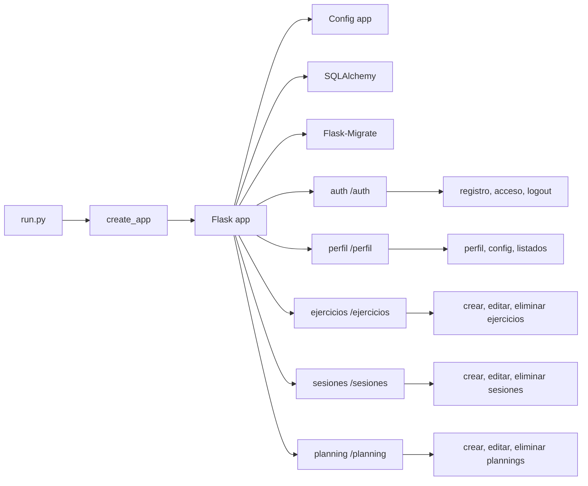
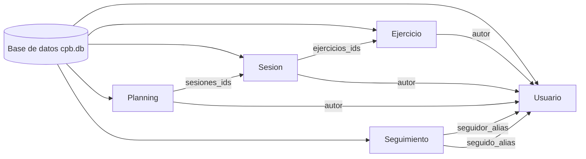

# Diagramas Backend Coach-Planning-Basketball

## 1. Arquitectura de la aplicación

## 2. Modelos y relaciones de datos

> Cada bloque es un diagrama Mermaid independiente; puedes previsualizarlos en VS Code o exportarlos a PNG.