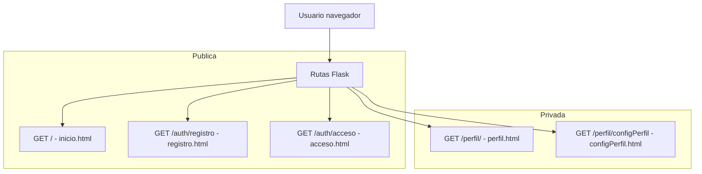
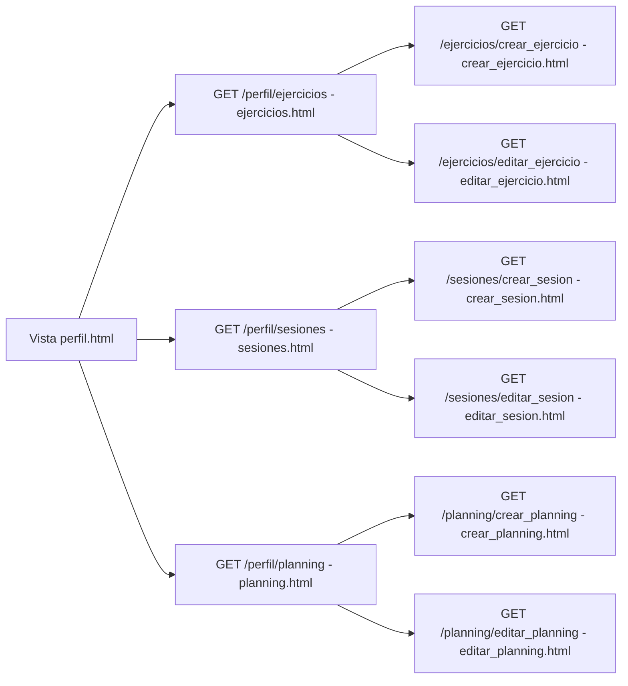

# Diagramas Frontend Coach-Planning-Basketball

## 1. Navegación principal

## 2. Zona privada: listados y CRUD

> Cada bloque es un diagrama Mermaid independiente; puedes previsualizarlos en VS Code o exportarlos a PNG.