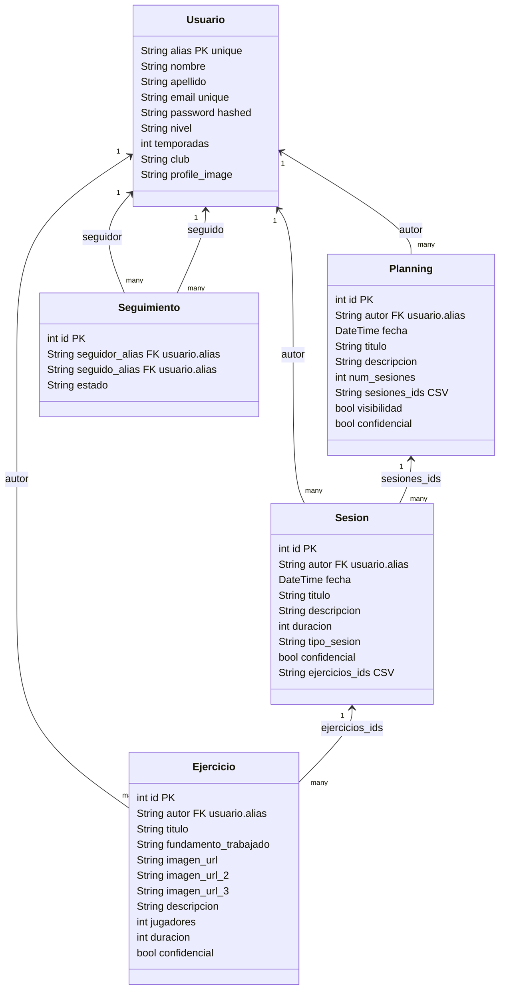

# Modelo de datos

Este documento describe las tablas de la base de datos `cpb.db` y sus relaciones, basadas en `app/models.py`.

## Tabla `usuario`

Representa a los entrenadores/usuarios de la plataforma.

- `alias` (String(20), PK, unique, not null)
- `nombre` (String(20), not null)
- `apellido` (String(20), not null)
- `email` (String, unique, not null)
- `password` (Text(20), not null) – contraseña hasheada
- `nivel` (String, null) – puede ser `1`, `2` o `Nacional`
- `temporadas` (Integer, null) – nº de temporadas de experiencia
- `club` (String, null)
- `profile_image` (String, null) – ruta relativa a la imagen de perfil

Relaciones:
- Es autor de: `ejercicio.autor`, `sesion.autor`, `planning.autor`.
- Participa en la tabla de relaciones `seguimiento` como seguidor y seguido.

---

## Tabla `ejercicio`

Recoge los ejercicios individuales que puede crear un usuario.

- `id` (Integer, PK, unique, not null)
- `autor` (String(20), FK → `usuario.alias`, not null)
- `titulo` (String(20), not null)
- `fundamento_trabajado` (String(20), not null) – p.ej: físico/técnico/táctico
- `imagen_url` (String, not null) – ruta de la imagen principal
- `imagen_url_2` (String, null) – imagen secundaria
- `imagen_url_3` (String, null) – imagen terciaria
- `descripcion` (String(500), null)
- `jugadores` (Integer, null) – nº de jugadores necesarios
- `duracion` (Integer, null) – duración en minutos
- `confidencial` (Boolean, default=False)

Relaciones:
- Pertenece a un `usuario` (campo `autor`).
- Puede ser referenciado desde `sesion.ejercicios_ids` (lista de IDs).

---

## Tabla `sesion`

Representa una sesión de entrenamiento (conjunto de ejercicios).

- `id` (Integer, PK, unique, not null)
- `autor` (String(20), FK → `usuario.alias`, not null)
- `fecha` (DateTime, not null)
- `titulo` (String(20), not null)
- `descripcion` (String(500), null)
- `duracion` (Integer, null) – suma de minutos de sus ejercicios asociados
- `tipo_sesion` (String(20), null) – por ejemplo: física/técnica/táctica
- `confidencial` (Boolean, default=False)
- `ejercicios_ids` (String, null) – lista de IDs de ejercicios separados por comas (máx. 10)

Relaciones:
- Pertenece a un `usuario` (campo `autor`).
- Se relaciona con varios `ejercicio` a través de `ejercicios_ids`.
- Puede ser referenciada desde `planning.sesiones_ids`.

---

## Tabla `planning`

Representa una planificación (conjunto de sesiones).

- `id` (Integer, PK, unique, not null)
- `autor` (String(20), FK → `usuario.alias`, not null)
- `fecha` (DateTime, not null)
- `titulo` (String(20), not null)
- `descripcion` (String(500), null)
- `num_sesiones` (Integer, null) – nº de sesiones incluidas
- `sesiones_ids` (String, null) – lista de IDs de sesiones separados por comas (máx. 10)
- `visibilidad` (Boolean, default=True)
- `confidencial` (Boolean, default=False)

Relaciones:
- Pertenece a un `usuario` (campo `autor`).
- Se relaciona con varias `sesion` mediante `sesiones_ids`.

---

## Tabla `seguimiento`

Tabla de relaciones entre usuarios (seguidores y seguidos).

- `id` (Integer, PK, unique, not null)
- `seguidor_alias` (String(20), FK → `usuario.alias`, not null)
- `seguido_alias` (String(20), FK → `usuario.alias`, not null)
- `estado` (String(20), not null, default='pendiente') – `pendiente`, `aceptado` o `rechazado`

Relaciones:
- Cada fila representa una relación "usuario seguidor" → "usuario seguido" con un estado.

---

## Visión general de relaciones (Mermaid)

